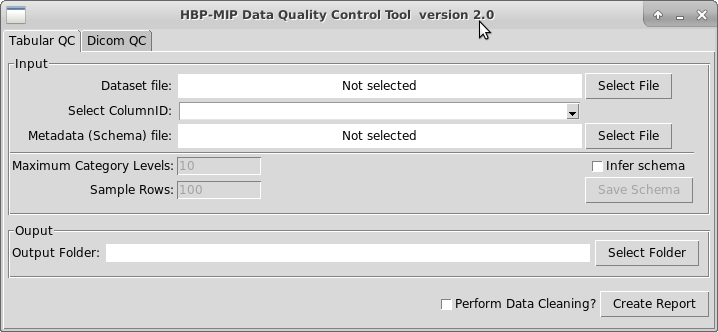
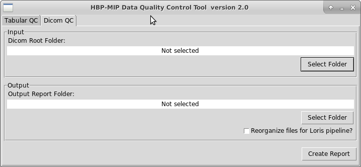

 [](https://www.codacy.com/app/iosifsp/QCtool?utm_source=github.com&amp;utm_medium=referral&amp;utm_content=aueb-wim/QCtool&amp;utm_campaign=Badge_Grade)  [](https://coveralls.io/github/aueb-wim/DataQualityControlTool?branch=master)

# HBP-MIP Data Quality Control Tool

## Description

This tool is a component developed for the [Human Brain Project Medical Informatics Platform](https://www.humanbrainproject.eu/en/medicine/medical-informatics-platform/) (HBP-MIP) and it developed with 
The tool has two major functionalities:
1. Validate data and produce reports with the validation results and with some overall statistics about the data
2. Perform data cleaning 
The main purpose of this tool is to produce statistical report of a given dataset and its variables (tabular dataset profiling) and propose value corrections for problematic data-entries. Also, the tool has the ability to extract and export meta-data headers of a set of DICOM MRIs.

## Installing / Getting started

### Prerequisites

Required installed packages for Debian based distros

-   python3, python3-pip, python3-tk
-   cairo
-   Pango
-   GDK-PixBuf

```shell
sudo apt-get update
sudo apt-get install build-essential python3-dev python3-pip python3-setuptools python3-wheel python3-cffi libcairo2 libpango-1.0-0 libpangocairo-1.0-0 libgdk-pixbuf2.0-0 libffi-dev shared-mime-info
```


Required installed software for Windows

-   [python version 3](https://www.python.org/downloads/)

-   GTK+ libraries
  
Please refer to the [WeasyPrint's documentation page](https://weasyprint.readthedocs.io/en/latest/install.html#windows) for installing the proper GDK+ version.

### Installation

In a terminal we run

```shell
git clone https://github.com/aueb-wim/DataQualityControlTool.git
cd DataQualityControlTool
sh install.sh
```
### Docker image

For containerized version of the qctool, build the docker image with:

```shell
sh build.sh
```

## Usage

**Command Line Interface**

For profiling a csv dataset:

``` shell 
Usage: qctool csv <options> <csv file>

  This command produces a validation report for <csv file>.

  The report file is stored in the same folder where <csv file> is located.

  <schema json> file MUST be compliant with frirctionless   data table-
  schema specs(https://specs.frictionlessdata.io/table-schema/).

Options:
  --col_id INTEGER              Column number that holds id values (primary
                                key)  [default: 1; required]
  --clean                       Filepath for the new dataset csv file after
                                data cleaning
  -m, --metadata <schema json>  Path of the metadata json file with the schema
                                of the dataset csv file
  --max_levels INTEGER          Max unique values of a text variable
                                that below that will be infered as nominal
                                when no <schema json> is provided  [default:
                                10]
  --sample_rows INTEGER         Number rows that are going to be used as
                                sample                     for infering the
                                dataset metadata (schema) when
                                <schema json> is not provided  [default: 100]
  --help                        Show this message and exit.
  ```

After the execution, the report is stored in a pdf file:


For profiling a dicom dataset:

``` shell
Usage: qctool dicom <options> <dicom folder> <report folder>
```

`<dicom folder>` is the root folder where the DICOM  is stored. It is assumed that each subfolder corresponds to one patient.

`<report folder>` is the folder where the report files will be placed. If the folder does not exist, the tool will create it.

Options: 

`--loris_folder`  folder path where the dcm files are reorganized for LORIS pipeline

For the LORIS pipeline the dcm files are reorganized in stored in a folder structure <loris_folder>/<patientid><patientid_visitcount>.
All the dcm sequence files that belong to the same scanning session (visit) are stored in a common folder <patientid>_<visitcount>

The tool creates in the `<report folder>`, a pdf report file (`dicom_report.pdf`) and, depending of the results, also creates the following csv files :

-   validsequences.csv
-   invalidsequences.csv
-   invaliddicoms.csv
-   notprocessed.csv
-   mri_visits.csv

The above files are created even if no valid/invalid sequences/dicoms files have been found. In such case, the files will be empty.
### validsequences.csv

If there are valid sequences then the tool will create this csv file. A sequence is 'valid' if it meets the minimum requirements found [here](https://hbpmedical.github.io/deployment/data/). This file contains all the valid MRI sequences that found in given DICOM folder with the following headers discribing each sequence:

`PatientID`, `StudyID`, `SeriesNumber`, `SeriesDescription`, `SeriesDate`

The value of the sequence tags `SeriesDescription` and `SeriesDate` are dirived from the headers in the  dicom files - more specifically, the value of a sequence tag is the most frequent value of this particular tag found in the sequence's dicom files.

### invalidsequences.csv

If there are invalid sequences the tool will create this csv file with the following headers:

`PatientID`, `StudyID`, `SeriesNumber`, `Slices`, `Invalid_dicoms`, `SeriesDescription`, `Error1`, `Error2`, `Error3`, `Error4`, `Error5`, `Error6`

-   `Slices` is the number of dicom files that the current sequence is consist of (sum of valid and invalid dicoms).
-   `Invilid_dicoms` is the number of invalid dicom files the current sequence.  
-   `Error1` - `Error6` is an error description that explains the reason why the sequence is characterized as 'invalid'

### invaliddicoms.csv

If a dicom file does not have at least one of the mandatory tags as described in the MIP specification found [here](https://hbpmedical.github.io/deployment/data/), then it will be characterized as 'invald'.
If there are invalid dicoms in the DICOM dataset, the tool will create this csv file with the following headers:

`Folder`, `File`, `PatientID`, `StudyID`, `SeriesNumber`, `InstanceNumber`, `MissingTags`

-   `MissingTags` is a list of the missing mandatory DICOM tags.

### notprocessed.csv

If in the given root folder are some files that the QC tool can not process (not dicom files, corrupted dicom files etc), the tool will create this csv file with the following headers describing the location of those files:

`Folder`, `File`

### mri_visits.csv

This file contains MRI visit information for each patient. This file is necessary for the HBP MIP DataFactory's [Step3_B](https://github.com/HBPMedical/ehr-datafactory-template#importing-the-volumetric-brain-features-into-the-i2b2-capture-database) and it has the following headers:

`PATIENT_ID`, `VISIT_ID`, `VISIT_DATE`


### GUI

We run `qctoolgui`




See **GUI User Guide** section in the wik for further usage details. 

## Features

-   Creates a statistical report for the dataset and its variables 
-   Creates a report with meta-data tags (headers) of each sequence (3D MRI Image) in a DICOM dataset
-   Command Line Interface and GUI

## Versioning

We use [SemVer](http://semver.org/) for versioning.

## Authors

-   Iosif Spartalis - AUEB/RC Data Science Team

## License

This project is licensed under the Apache 2.0 License - see the [LICENSE](LICENSE) file for details

## Acknowledgements

This work is part of SP8 of the Human Brain Project (SGA2).

Special thanks to:

-   **Prof. Vasilis Vassalos** - Athens University of Economics and Business
-   **Kostis Karozos** - AUEB/RC Data Science Team, Ph.D candiate
-   **Jacek Manthey** - CHUV
