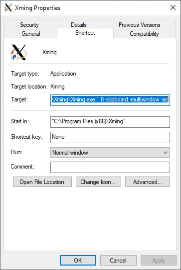

 [](https://www.codacy.com/app/iosifsp/QCtool?utm_source=github.com&amp;utm_medium=referral&amp;utm_content=aueb-wim/DataQualityControlTool&amp;utm_campaign=Badge_Grade)  [](https://coveralls.io/github/aueb-wim/DataQualityControlTool?branch=master)

# HBP-MIP Data Quality Control Tool

## Description

This tool is a component developed for the [Human Brain Project Medical Informatics Platform](https://www.humanbrainproject.eu/en/medicine/medical-informatics-platform/) (HBP-MIP) and it main perpose is to provide hospital personel an easy way to explore, validate and transform their data before uploading them into the MIP.
The tool has the following functionalities:
1. Validating the hospital EHR data and producing report with validation results and some overall statistics about the data.
2. Data cleaning capability.
3. Inference of a dataset's schema and producing a schema file in [Frictionless](https://frictionlessdata.io/) or Data Catalogue format.
4. Designing and performing schema mapping of an incoming hospital dataset to a certain Pathology's Common Data Element (CDE) schema.
5. Producing DICOM MRIs validation and statistical report based on their meta-data headers.

## Installation

### Installation Linux (through deb file)

First download the proper deb package for your system version(currently the deb packages are for **ubuntu 16.04, 18.04 and 20.04**) then install the deb package in terminal by giving the below command (The deb file can be ):

```shell
sudo apt-get update
sudo dpkg -i path_to_deb_file
```

```shell
Selecting previously unselected package mipqctool.
(Reading database ... 32232 files and directories currently installed.)
Preparing to unpack mipqctool_4.0_amd64_ubuntu_20.04.deb ...
Unpacking mipqctool (4.0) ...
dpkg: dependency problems prevent configuration of mipqctool:
 mipqctool depends on python3-tk; however:
  Package python3-tk is not installed.
 mipqctool depends on libcairo2; however:
  Package libcairo2 is not installed.
 mipqctool depends on libpango-1.0-0; however:
  Package libpango-1.0-0 is not installed.
 mipqctool depends on libpangocairo-1.0-0; however:
  Package libpangocairo-1.0-0 is not installed.
 mipqctool depends on libgdk-pixbuf2.0-0; however:
  Package libgdk-pixbuf2.0-0 is not installed.
 mipqctool depends on libffi-dev; however:
  Package libffi-dev is not installed.

dpkg: error processing package mipqctool (--install):
 dependency problems - leaving unconfigured
Processing triggers for libc-bin (2.31-0ubuntu9.2) ...
Errors were encountered while processing:
 mipqctool
```

If some dependancies haven't been installed succesfully. 
```shell
sudo apt-get update --fix-missing
sudo apt-get install -f
```

### Manual installation Linux

Required installed packages for Debian based distros

-   python3, python3-pip, python3-tk
-   cairo
-   Pango
-   GDK-PixBuf

To install the above packages, give in a terminal the below commands:

```shell
sudo apt-get update
sudo apt-get install build-essential python3-dev python3-pip python3-setuptools python3-wheel python3-cffi python3-venv python3-tk libcairo2 libpango-1.0-0 libpangocairo-1.0-0 libgdk-pixbuf2.0-0 libffi-dev shared-mime-info
```

In the case were of using the deb file for the installation, the above packages are installed automatically during the installation.


Required installed software for Windows

-   [python version 3](https://www.python.org/downloads/)

-   GTK+ libraries
  
Please refer to the [WeasyPrint's documentation page](https://weasyprint.readthedocs.io/en/latest/install.html#windows) for installing the proper GDK+ version.

In a terminal we run

```shell
git clone https://github.com/aueb-wim/DataQualityControlTool.git
cd DataQualityControlTool
python3 -m venv venv/qctool
source venv/qctool/bin/activate
pip install --upgrade pip
sh install.sh
```

### Installation Windows with WLS 2

**Prerequisites**
-  Windows 10
-  [WLS version 2](https://docs.microsoft.com/en-us/windows/wsl/install-win10) (Windows Linux Subsystem) 
- [Docker Desktop for WLS](https://docs.docker.com/docker-for-windows/wsl/) 
-  Xming - [X server for Windows](https://sourceforge.net/projects/xming/)

Note: The Data Quality Control tool could be run in Windows with WLS 1 without docker client, but it won't have the data mapping functionality.

**Configuration of Xming for WLS 2**
`WLS 2` and `Xming` combination has some issues. The good news is that WLS version 2 will obtain a native support for linux GUI applications in the near future, so `Xming` won't be necessary for running the DQC tool. Until then, we have to configure the `Xming` properly.

1. When installing or running Xming for the first time, in Windows Defender Firewall pop up, please check both boxes, for Private and Public networks.

2. In the Xming shortcut properties, edit the `target` field by adding ` -ac` at the end. An example of the final string maybe will be like this: `"C:\Program Files (x86)\Xming\Xming.exe" :0 -clipboard -multiwindow -ac`
 

**Installation and running the DQC tool**

1. Download the proper deb package matching the WLS ubuntu version (using **Ubuntu:20.04** is recommended) then install the deb package in WLS terminal by giving the following command:

```shell
sudo dpkg -i path_to_deb_file
```
If some dependancies haven't been installed succesfully. 
```shell
sudo apt-get update --fix-missing
sudo apt-get install -f
```

2. Start the X Server from Windows' Start Menu
3. Set up the X Server by giving the following command in WLS terminal
```shell
export DISPLAY=$(awk '/nameserver / {print $2; exit}' /etc/resolv.conf 2>/dev/null):0
export LIBGL_ALWAYS_INDIRECT=1
```
4. Launch the application 
```shell
qctoolgui
```

## Usage

### Command Line Interface


For profiling/validating a csv dataset:

``` shell
Usage: qctool csv <options> <csv file> <schema json>

  This command produces a validation report for <csv file>.

  The report file is stored in the same folder where <csv file> is located.

  <schema json> file MUST be compliant with frirctionless   data table-
  schema specs(https://specs.frictionlessdata.io/table-schema/) or   with
  Data Catalogue json format.

Options:
  --clean                 Flag for performing data cleaning.The cleaned file will 
                          be saved in the report folder.

  -m, --metadata [dc|qc]  Select "dc" for Data Catalogue spec json
                          or "qc" for frictionless spec json.

  -r, --report [xls|pdf]  Select the report file format.
  -o, --outlier FLOAT     outlier threshold in standard deviations.
  --help                  Show this message and exit.
  ```

**outlier threshold** input field is related with the outlier detection for numerical variables of the incoming dataset. The way that the Data Quality Control tool handles the outlier detection of a certain numerical variable, is that first calculates the **mean** and the **standard deviation** based on the valid values of that column and then calculates the upper and the lower limit by the formula: `upper_limit = mean + outlier threshold * standard deviation`, `lower_limit = mean - outlier threshold * standard deviation`. If any value is outside those limits then it is considered as an outlier. 

The report file will be saved in the folder where the incoming dataset file is located.


#### Data Cleaning

After reviewing the **Data Validation** report created in the previous step (Please refer to the **Data Validation Report** wiki section for further details), we can proceed with the data cleaning operation. The cleaned dataset file will be saved in same folder where the incoming dataset is located by using the original dataset name with the addition of the suffix '_corrected'.

For infering a dataset's schema:

```shell
Usage: qctool infercsv <options> <csv file>

  This command infers the schema of the <csv file> it and stored in <output
  file>.

  The <output file> either a json file following the frictionless data
  specs(https://specs.frictionlessdata.io/table-schema/) or an xlsx file
  following MIP Data Catalogue's format.

Options:
  --max_levels INTEGER         Max unique values of a text variable
                               that below that will be infered as nominal
                               [default: 10]

  --sample_rows INTEGER        Number rows that are going to be used as sample
                               for infering the dataset metadata (schema)
                               [default: 100]

  --schema_spec [dc|qc]        Select "dc" for Data Catalogue spec xlsx file
                               or "qc" for frictionless spec json.

  --cde_file PATH              CDE dictionary Excel file (xlsx)
  -t, --threshold FLOAT RANGE  CDE similarity threshold.
  --help                       Show this message and exit.
```

 The schema could be saved in two formats:
1. Frictionless spec json
2. Data Catalogue's spec Excel (xlsx) file, that can be used for creating a new CDE pathology version.

In the infer option section, we give the number of rows that the tool will based on for the schema inference. Also, we declare the maximum number of categories that a `nominal` MIPType variable can have. 

If we choose the Data Catalogue's excel as an output, the tool offers the option of suggesting CDE variables for each column of the incoming dataset. This option is possible, only when a CDE dictionary is provided. This dictionary is an excel file that contains information for all the CDE variables that are included or will be included in the MIP (this dictionary will be available in the Data Catalogue in the near future). The tool calculates a similarity measure for each column based on the column name similarity (80%) and the value range similarity (20%). The similarity measure takes values between 0 and 1. With the option **similarity threshold** we can define the minimum similarity measure between an incoming column and a CDE variable that need to be met in order the tool to suggest that CDE variable as a possible correspondence. The tool stores those CDE suggestions in the excel file in the column named **CDE** and  also stores the corresponding concept path under the column **conceptPath**.

For profiling a dicom dataset:

``` shell
Usage: qctool dicom <options> <dicom folder> <report folder>
```

`<dicom folder>` is the root folder where all DICOM files are stored. It is assumed that each subfolder corresponds to one patient.

`<report folder>` is the folder where the report files will be placed. If the folder does not exist, the tool will create it.

Options: 

`--loris_folder`  folder path where the dcm files are reorganized for LORIS pipeline

For the LORIS pipeline the dcm files are reorganized and stored in a folder structure `<loris_folder>/<patientid>/<patientid_visitcount>`.
All the dcm sequence files that belong to the same scanning session (visit) are stored in the common folder `<patientid_visitcount>`.

The tool creates in the `<report folder>`, a pdf report file (`dicom_report.pdf`) and, depending of the results, also creates the following csv files :

-   validsequences.csv
-   invalidsequences.csv
-   invaliddicoms.csv
-   notprocessed.csv
-   mri_visits.csv

The above files are created even if no valid/invalid sequences/dicoms files have been found. In such case, the files will be empty.
### validsequences.csv

If there are valid sequences then the tool will create this csv file. A sequence is 'valid' if it meets the minimum requirements found [here](https://hbpmedical.github.io/deployment/data/). This file contains all the valid MRI sequences that found in given DICOM folder with the following headers discribing each sequence:

`PatientID`, `StudyID`, `SeriesNumber`, `SeriesDescription`, `SeriesDate`

The value of the sequence tags `SeriesDescription` and `SeriesDate` are dirived from the headers in the  dicom files - more specifically, the value of a sequence tag is the most frequent value of this particular tag found in the sequence's dicom files.

### invalidsequences.csv

If there are invalid sequences the tool will create this csv file with the following headers:

`PatientID`, `StudyID`, `SeriesNumber`, `Slices`, `Invalid_dicoms`, `SeriesDescription`, `Error1`, `Error2`, `Error3`, `Error4`, `Error5`, `Error6`

-   `Slices` is the number of dicom files that the current sequence is consist of (sum of valid and invalid dicoms).
-   `Invilid_dicoms` is the number of invalid dicom files the current sequence.  
-   `Error1` - `Error6` is an error description that explains the reason why the sequence is characterized as 'invalid'

### invaliddicoms.csv

If a dicom file does not have at least one of the mandatory tags as described in the MIP specification found [here](https://hbpmedical.github.io/deployment/data/), then it will be characterized as 'invald'.
If there are invalid dicoms in the DICOM dataset, the tool will create this csv file with the following headers:

`Folder`, `File`, `PatientID`, `StudyID`, `SeriesNumber`, `InstanceNumber`, `MissingTags`

-   `MissingTags` is a list of the missing mandatory DICOM tags.

### notprocessed.csv

If in the given root folder are some files that the QC tool can not process (not dicom files, corrupted dicom files etc), the tool will create this csv file with the following headers describing the location of those files:

`Folder`, `File`

### mri_visits.csv

This file contains MRI visit information for each patient. This file is necessary for the HBP MIP DataFactory's [Step3_B](https://github.com/HBPMedical/ehr-datafactory-template#importing-the-volumetric-brain-features-into-the-i2b2-capture-database) and it has the following headers:

`PATIENT_ID`, `VISIT_ID`, `VISIT_DATE`


### GUI

We run `qctoolgui`

See **GUI User Guide** section in the wiki for further usage details. 

## Features

-   Creates a statistical/validation report for the dataset and its variables.
-   Perform data cleaning based on a given schema.
-   
-   Infer the schema of a dataset which is in csv format.
-   Creates a report with meta-data tags (headers) of each sequence (3D MRI Image) in a DICOM dataset.
-   Command Line Interface and GUI.

## Versioning

We use [SemVer](http://semver.org/) for versioning.

## Authors

-   Iosif Spartalis - AUEB/RC Data Science Team

## License

This project is licensed under the Apache 2.0 License - see the [LICENSE](LICENSE) file for details

## Acknowledgements

This work is part of SP8 of the Human Brain Project (SGA2).

Special thanks to:

-   **Prof. Vasilis Vassalos** - Athens University of Economics and Business
-   **Kostis Karozos** - AUEB/RC Data Science Team, Ph.D candidate
-   **Abu-Nawwas Laith** - CHUV
-   **Jacek Manthey** - CHUV
